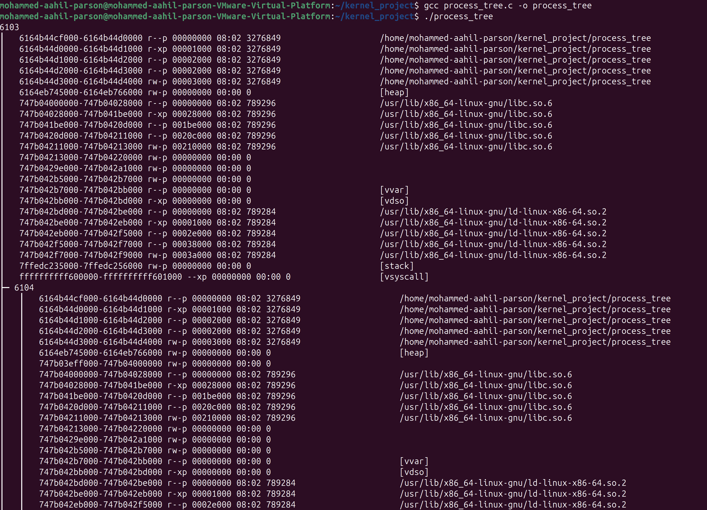
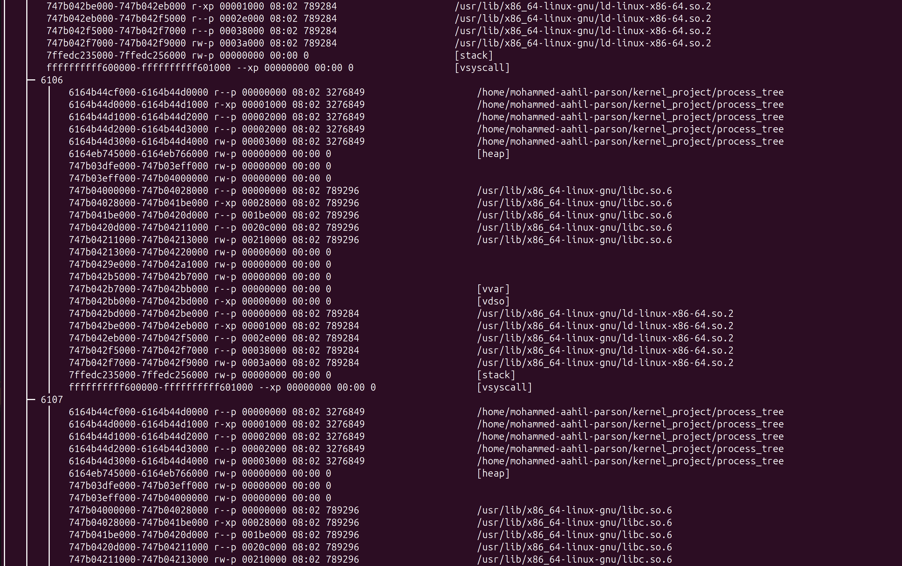
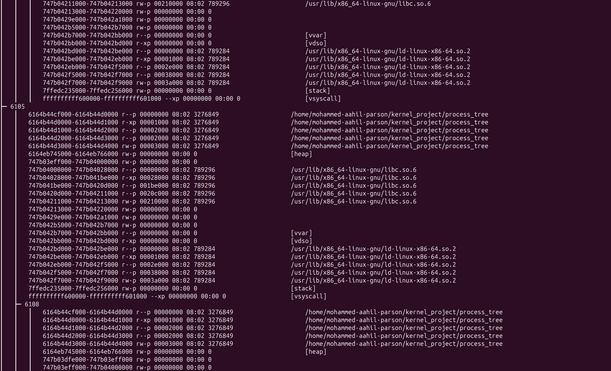
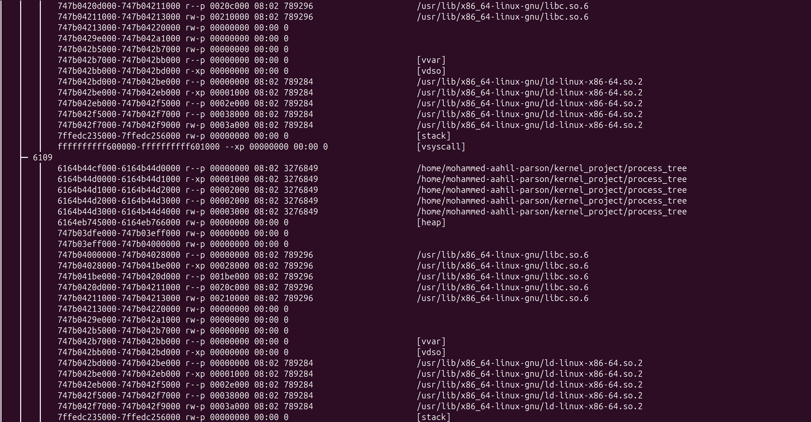

# OS-Linux-Kernel: Process Tracking System

A Linux project demonstrating process hierarchy creation and memory map analysis, combining a kernel module and user-space program.

## Table of Contents
- [Features](#features)
- [Prerequisites](#prerequisites)
- [Installation](#installation)
- [Output Demonstration](#output-demonstration)

## Features

- **Kernel Module**
  - Logs module load/unload events to the kernel ring buffer
  - Demonstrates basic kernel module development
  - Uses proper kernel memory management practices

- **User-Space Program**
  - Creates a hierarchical process tree (parent → children → grandchildren)
  - Dynamically allocates memory in each process
  - Generates process tree visualization with memory maps
  - Automatically cleans up child processes

## Prerequisites

- Ubuntu 22.04 LTS (or later)
- VMware Fusion/VirtualBox (for Mac users)
- Build essentials:
  ```bash
  sudo apt install build-essential gcc make linux-headers-$(uname -r)
  ```

- Kernel development tools
- Root/sudo access

## Installation
**1. Clone the repository:**
```bash
git clone https://github.com/moaahil1110/OS-Linux-Kernel.git
cd OS-Linux-Kernel
```
**2. Compile components:**
```bash
#1. Create a project directory
mkdir ~/kernel_project && cd ~/kernel_project
```

```bash
#2. Write down the Kernel Module (in Ubuntu Terminal)
nano Kernel-Module.c
```

```bash
#3. Write down the code in the Makefile (in Ubuntu Terminal)
nano Makefile
```

```bash
#4. This generates process_tracker.ko.
make
```

```bash
#5. Check if the files are there in the directory or not
ls -l
```

```bash
#6. Load the module
sudo insmod Kernel-Module.ko
```

```bash
#7. Verify (check for "Kernel Module Loaded" message)
sudo dmesg | tail
```

```bash
#8. Type/Paste the User Program Code after the following command
nano User-Program-Code.c
```

```bash
#9. Verify if the code is present
cat User-Program-Code.c
```
```bash
#10. Compile and Run
  #10a.Compile
gcc User-Program-Code.c -o User-Program-Code

  #10b.Run (no sudo needed)
./User-Program-Code
```

**3. Once done, do the following:**
```bash
#1. Unload the Module
sudo rmmod process_tracker
```

```bash
#2. Verify Unload: Check the kernel logs to confirm the module was unloaded:
sudo dmesg | tail
```

**Optional: If you want to test everything again:**
-Test Everything Again:
    -Load the module, run the user program, and unload the module to ensure everything works as expected.


## Output Demonstration:

Here’s a sample output showing the process tree and memory maps:

**1.**


**2.**


**3.**


**4.**

